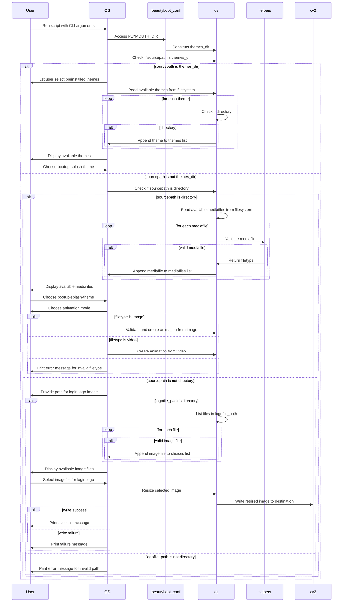

# Logical flowchart

```mermaid
sequenceDiagram
    participant User
    participant OS
    participant beautyboot_conf
    participant os
    participant helpers
    participant cv2

    User->>OS: Run script with CLI arguments
    OS->>beautyboot_conf: Access PLYMOUTH_DIR
    beautyboot_conf->>os: Construct themes_dir
    OS->>os: Check if sourcepath is themes_dir
    alt sourcepath is themes_dir
        OS->>User: Let user select preinstalled themes
        OS->>os: Read available themes from filesystem
        loop for each theme
            os->>os: Check if directory
            alt directory
                os->>OS: Append theme to themes list
            end
        end
        OS->>User: Display available themes
        User->>OS: Choose bootup-splash-theme
    else sourcepath is not themes_dir
        OS->>os: Check if sourcepath is directory
        alt sourcepath is directory
            os->>os: Read available mediafiles from filesystem
            loop for each mediafile
                os->>helpers: Validate mediafile
                alt valid mediafile
                    helpers->>os: Return filetype
                    os->>OS: Append mediafile to mediafiles list
                end
            end
            OS->>User: Display available mediafiles
            User->>OS: Choose bootup-splash-theme
            OS->>User: Choose animation mode
            alt filetype is image
                OS->>os: Validate and create animation from image
            else filetype is video
                OS->>os: Create animation from video
            else
                OS->>User: Print error message for invalid filetype
            end
        else sourcepath is not directory
            OS->>User: Provide path for login-logo-image
            alt logofile_path is directory
                os->>os: List files in logofile_path
                loop for each file
                    alt valid image file
                        os->>OS: Append image file to choices list
                    end
                end
                OS->>User: Display available image files
                User->>OS: Select imagefile for login-logo
                OS->>os: Resize selected image
                os->>cv2: Write resized image to destination
                alt write success
                    OS->>User: Print success message
                else write failure
                    OS->>User: Print failure message
                end
            else logofile_path is not directory
                OS->>User: Print error message for invalid path
            end
        end
    end
```